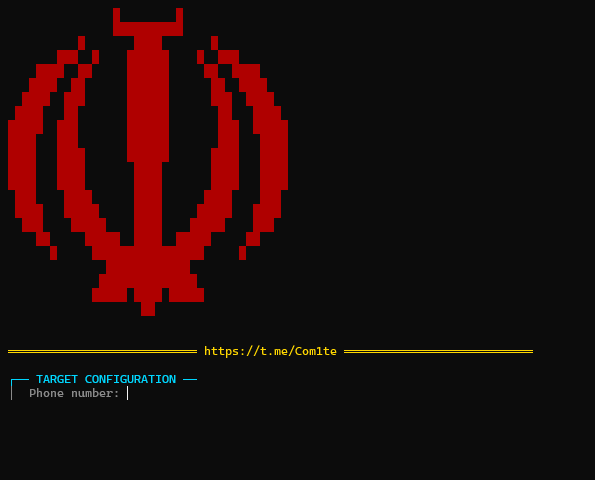

<p align="center">
  
</p>

<h1 align="center"> SMS-Bomber </h1>
<p align="center">

---

## 📸 تصویر اسکریپت

---

## 🔥 قابلیت‌های پیشرفته

| ویژگی | توضیح |
|-------|-------|
| **بمباران SMS** | بیش از ۵۰ API فعال برای ارسال پیامک |
| **بمباران تماس** | پشتیبانی از ۲۰+ API تماس همزمان |
| **چندنخی (Multi-thread)** | تنظیم تعداد نخ همزمان برای هر API |
| **حالت حمله ترکیبی** | اجرای همزمان SMS + CALL |
| **اینترفیس ترمینال رنگی** | نمایش Matrix-like با افکت تایپ و جرقه |
| **انتخاب فایل API** | امکان استفاده از API.json یا API_fast.json |

---

## 📦 نصب (مرحله به مرحله)

### 1. کلون کردن ریپازیتوری
```bash
git clone https://github.com/Asn780/SMS-Bomber.git
cd SMS-Bomber
```

### 2. نصب پیش‌نیازها
```bash
pip install -r requirements.txt
```

### 3. اجرا
```bash
python main.py
```

---

## 🎮 راهنمای استفاده (گام به گام)

1. **اجرای ابزار**  
   `python main.py` را اجرا کنید.

2. **ورود شماره هدف**  
   شماره مورد نظر را بدون صفر اول وارد کنید (مثال: `9123456789`).

3. **انتخاب فایل API**  
   - گزینه 1: `api.json` (همه API‌ها - کندتر اما کامل‌تر)  
   - گزینه 2: `api_fast.json` (API‌های سریع و فعال)  
   - گزینه 3: مسیر سفارشی.

4. **انتخاب نوع حمله**  
   - `1`: فقط SMS  
   - `2`: فقط تماس  
   - `3`: هر دو (حمله ترکیبی)

5. **تنظیم تعداد حلقه‌ها و نخ‌ها**  
   - حلقه: تعداد دفعات اجرای کل API‌ها  
   - نخ در هر API: تعداد درخواست همزمان برای هر API

6. **آغاز حمله**  
   ابزار به طور خودکار شروع به کار کرده و نتیجه نهایی را نمایش می‌دهد.

---

## 🛠️ ساختار فایل‌ها

| فایل | توضیح |
|------|-------|
| `main.py` | هسته اصلی ابزار |
| `api.json` | دیتابیس کامل API‌ها (۵۰+ عدد) |
| `api_fast.json` | API‌های سریع و عملیاتی |
| `requirements.txt` | کتابخانه مورد نیاز (requests) |
| `install.bat` | نصب خودکار در ویندوز |
| `install.sh` | نصب خودکار در لینوکس/ترموکس |
| `docs/` | مستندات تکمیلی (در حال توسعه) |

---

## 📊 نمونه خروجی

```
┌── SMS ATTACK [1/3] ──
✓ api1.sms.com                             [245ms]
✓ fast-sms.net                             [187ms]
✗ old-api.org                              [404]
└── Result: ✓ 42 | ✗ 8

═══════════════════════════════════════════
╔═════════════════════════════════════════╗
║                 FINAL RESULTS            ║
╠═════════════════════════════════════════╣
║  ✓ Successful: 126                      ║
║  ✗ Failed: 24                           ║
║  * Total Requests: 150                  ║
║  📊 Success Rate: 84.0%                 ║
╚═════════════════════════════════════════╝
```

---


## 📞 ارتباط با توسعه‌دهنده

<p align="center">
  <a href="https://t.me/Com1te">
    
  </a>
</p>

---

<p align="center">
  <strong>⭐ اگر این پروژه برات مفید بود، بهش ستاره بده! ⭐</strong>
</p>
